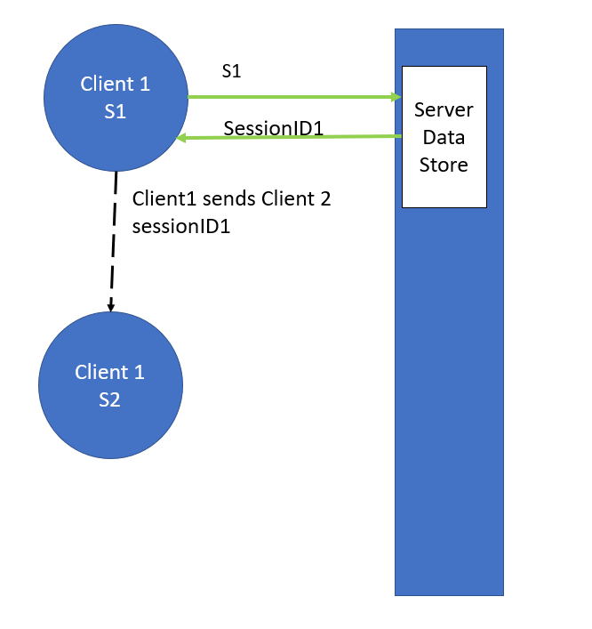

<div id="top"></div>


<!-- PROJECT LOGO -->
<br />
 

<h3 align="center">PSI Application</h3>

  <p align="center">
Simple Web Application Backend and CLI Client for PSI Applications    <br />
    </p>


<!-- ABOUT THE PROJECT -->
## About The Project

CZ 4010 Project for topic: Private Set Intersection.

###Motivation
Private Set Intersection is a cryptographic technique to compute the intersection of sets held by 2
parties without revealing them to each other. Aside from its theoretical significance, this multiparty computation
application has seen various real-life use cases:
* Finding Contacts</br>
Several messaging services (Whatsapp, Telegram, etc) relies on numbers stored in your phone contacts
to find other contacts that are using the service. PSI allows users to share these messaging providers
about their contacts that are already registered without sharing their list of contacts
* COVID 19 Contact Tracing</br>
PSI allow COVID 19 Contact Tracing clients to track if users have came into close contact
with COVID 19 cases without revealing to the server the user's location history.

* Data Sharing Incentive</br>
A certain variant of the PSI only allows users to calculate the intersection whilst the
service provider does not gain any information.This protocol allows users to perform the PSI protocol (data matching,validation,etc) to a service without exposing their own data. 
This allows service providers to provide services where users can calculate the PSI of their set with the provider's data set for a certain incentive.</br>
</br>
Users can provide providers incentive in exchange for allowing them to validate/match their data set with the provider.
Without either party learning the other's information.</br>

Inspired by the project motivation: Grab and Gojek, this project is aimed for computing set intersection between enterprise applications
and will based on a server-client setup to mimic how business to business applications are generally setup.

### Research
Since PSI is a relatively less researched subject, when building the project, I looked for libraries that:
* <b>Actively contributed</b>
</br>
PSI has seen a marked interest in research recently. An active project is more likely to be
up to date with recent advances on the subject.
</br>
* <b>Implements well tested PSI Protocols</b>
</br>
The protocol itself should not weaken the security provided by the cryptographic primitive
* <b>Minimal data transfer size</b>
</br>There are several variants of PSI with varying data transfer size and computational complexity.
Since we will be dealing with large data sizes, the data transfer size will quickly become a bottleneck to the overall
performance of the protocol.</br>
</br>
Large scale data transfer through the internet may introduce unpredictable factors to the performance. Thus, we've decided to lower data transfer size at the cost of computational complexity.
This works well with the server-client setup that we have decided on as servers have immense computational capability.

With these factors in mind, we settled on a protocol by

Emiliano De Cristofaro and Gene Tsudik. Practical private set intersection protocols with linear
complexity. In International Conference on Financial Cryptography and Data Security, pages
143–159. Springer, 2010.
</br>

This paper presents a PSI protocol that requires a relatively low amount of data to be transfered between to two parties but also 
manages an acceptable time complexity. The implementation of this paper is then found on https://github.com/OpenMined/PSI
which conveniently also includes a python binding.

### Design
In the spirit of the original motivation of the project, we've decided on a client-server architecture. Since B2B applications
would generally rely on server to server communications, the focus on this project will be on developing a server that can easily
interface with other entities without relying on a front end client.</br>

To do that, a REST backend API service fits the application well. The server is designed as the endpoint for a PSI Application of businesses.
This server can then communicate with the PSI endpoint of another business, allowing enterprises to calculate data intersection
without actually revealing their contents.

The CLI client allows us to interface with the data easily, since the way the server communicates with the CLI
is very similar with that of another server
<p align="right">(<a href="#top">back to top</a>)</p>

### Protocol
For the purpose of this explanation, we'll use the Client to Server communication scheme

#### Setup Phase


1.Provider sends server with data S
2.Server sends provider sessionID
3.Provider sends users the sessionID

#### Calculation Phase

1. User encrypt their data S2 with key K
2. User sends encrypted message H to server with session ID
3. Server calculates response/setup message with Response(H,S) 
4. Server sends response R to user
5. User decodes R with K and receives intersection

#### Server to server Setup
Server to server scheme has a similar schem to that of the client to server. But in this case, each server acts both as the
"Client" and "Server" at the same time : Each server hosts their own data, and send their encrypted data to the other party
to perform the PSI. For the server to server context, each server is their own provider as they manage their own data and 
their sessions keys while the other server is their "User"
### Built With

* [Django](https://www.djangoproject.com/)
* [Django-Rest-Framework](https://www.django-rest-framework.org/)
* [OpenMined](https://github.com/OpenMined/PSI)

<p align="right">(<a href="#top">back to top</a>)</p>


<!-- GETTING STARTED -->
## Getting Started

To get a local copy up and running follow these simple example steps.

### Prerequisites

* python 3.9.*

* django
    ```sh
    pip install django
    ```
* django-rest-framework
    ```sh
    pip install djangorestframework
    ```
* openmined-psi
    ```sh
    pip install openmined.psi
    ```

### Installation

1.Clone the repo
   ```sh
   git clone https://github.com/github_username/repo_name.git
   ```
2.Install python packages
   ```sh
   pip install requirement.txt
   ```
   or
   ```sh
   pip install django
   pip install djangorestframework
   pip install openmined.psi
   ```

<p align="right">(<a href="#top">back to top</a>)</p>

<!-- USAGE EXAMPLES -->
## Usage

###Backend Server
Recommended to setup the packages in a virtual environment.</br>

Run the webserver with:
```sh
python manage.py runserver
```
The server is hosted on [http://localhost:8000/](http://localhost:8000/) by default. Acess the admin page through
[http://localhost:8000/admin/](http://localhost:8000/admin/) where you can view and manage all the models stored
on the sqlite database.

To access the admin page you can use the credentials:
```sh
Username: marvin
password: admin
```
Or create an admin account with:
```sh
python manage.py createsuperuser
```

and enter your username:

```sh
Username: admin
```

your email address:

```sh
Email address: admin@example.com
```

and your password twice:
```sh
Password: **********
Password (again): *********
Superuser created successfully.
```

### CLI Client
To run the CLI Client simply use:
```sh
python CLIClient.py
```
<p align="right">(<a href="#top">back to top</a>)</p>

Functions provided by the CLI Client:
- Login</br>
Login with username and password,the client is granted a token to access the APIs for that session
- Register</br>
Register as a user to the database
- Upload Data</br>
Upload Dataset to the server for storage. This is required if another user wishes to perform
the PSI protocol with the dataset.
- New Session</br>
Create a new PSI sharing session using one of the datasets that you uploaded. This will yield a sessionID. Only users that
knows the SessionID can perform PSI with the uploaded dataset.
- Join Session</br>
Joins a PSI sharing session with a provided sessionID. The server then begins to calculate the setup/response message for the protocol.
This is a calculation intensive part and is written to be parallelizable.Note: The session creator/host won't be able to
compute the PSI, only the joiner can.
- View PSI Result</br>
Retrieve data for all PSI sessions that you joined and their status. If the server side calculation is finished,
the user can retrieve the setup and response message to calculate the PSI.
- View My Hosted Sessions </br>
View the sharing sessions that you started and their status.
## Features

- Authenticated Access</br>
User access is limited to authentication through the Login and Register
functionality

- Decoupled Authentication</br>
Easily integrates with custom third party authentication due to decoupleing between
authentication and core application mechanisms. Easy for enterprsies to deploy and integrate to their network
- Customizable Key storage scheme
Storing client side key is customizable with custom encryption and decryption mechanisms
- Minimal Network Traffic</br>
PSI protocol request and responses are sent through protobuf data, minimizing netowrk traffic bottleneck
- Paralellizable</br>
Protocol segment that is calculation heavy is written in such a way that it is 
simple to delegate to a parallel thread/process and is independent with the rest of the environment.


<p align="right">(<a href="#top">back to top</a>)</p>


<!-- CONTACT -->
## Contact


Email: marvin001@e.ntu.edu.sg
<p align="right">(<a href="#top">back to top</a>)</p>


